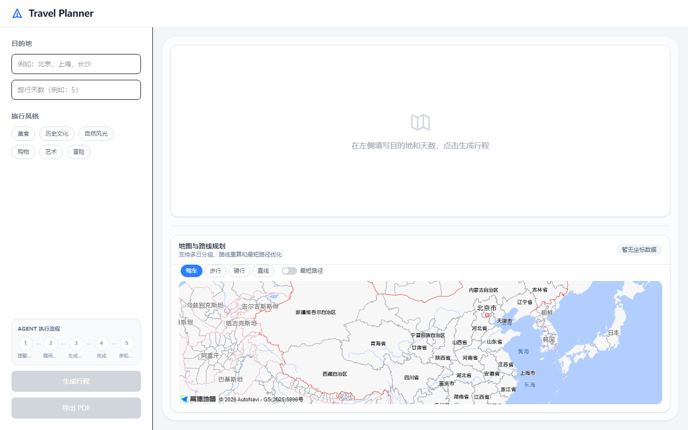
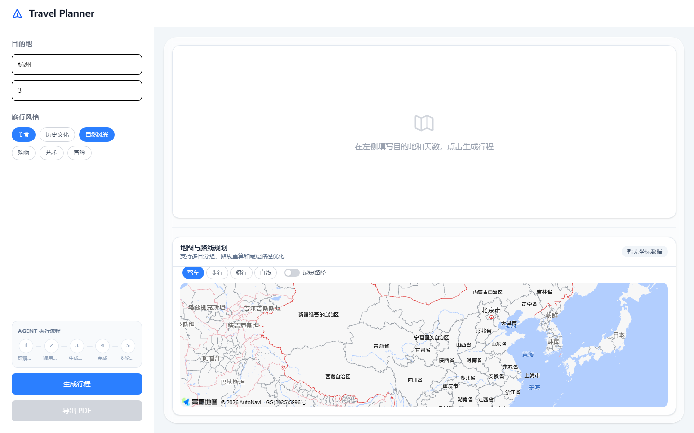
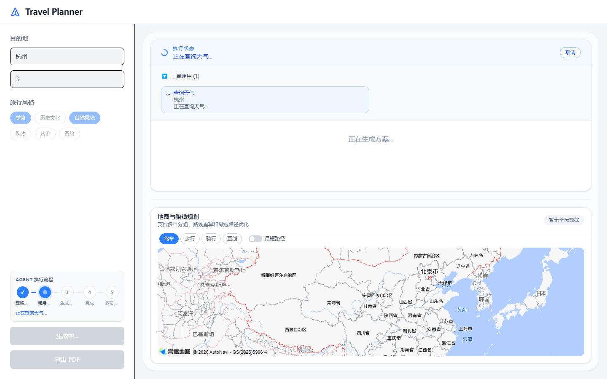
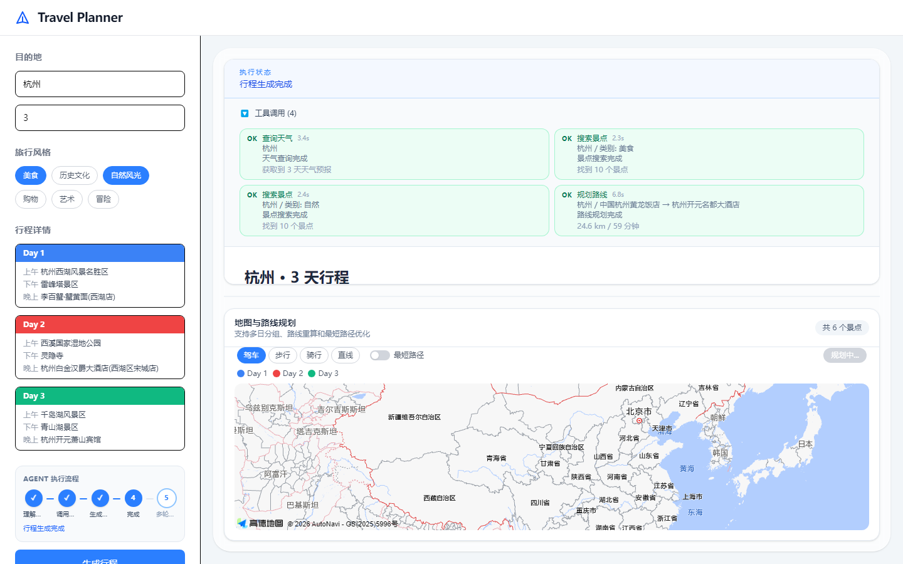
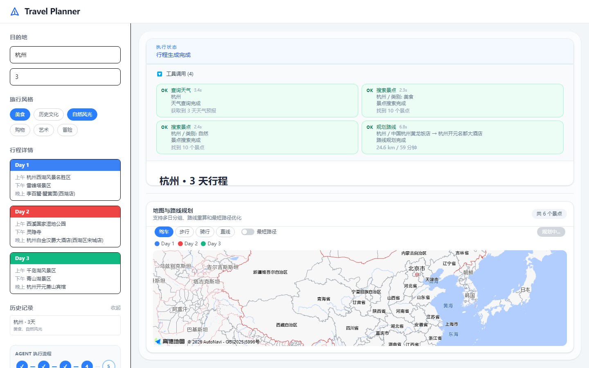
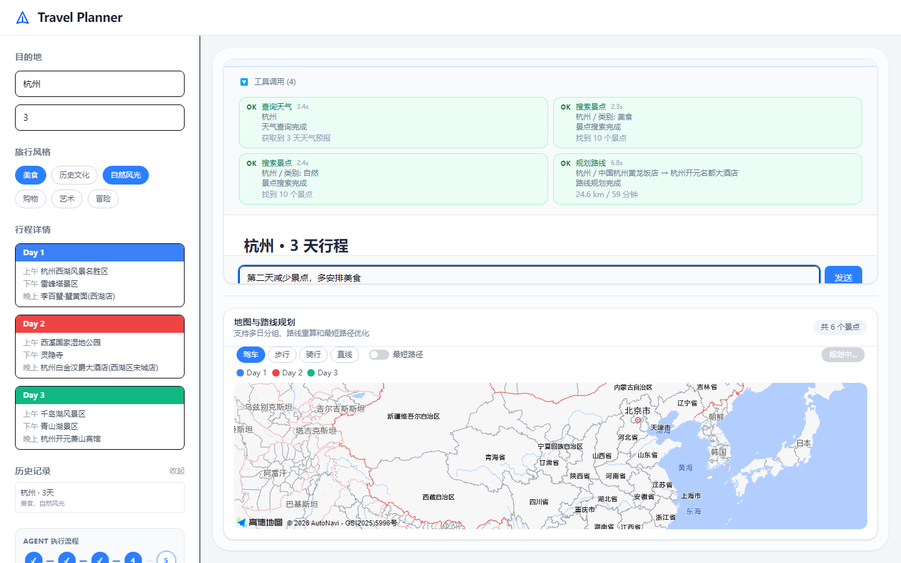
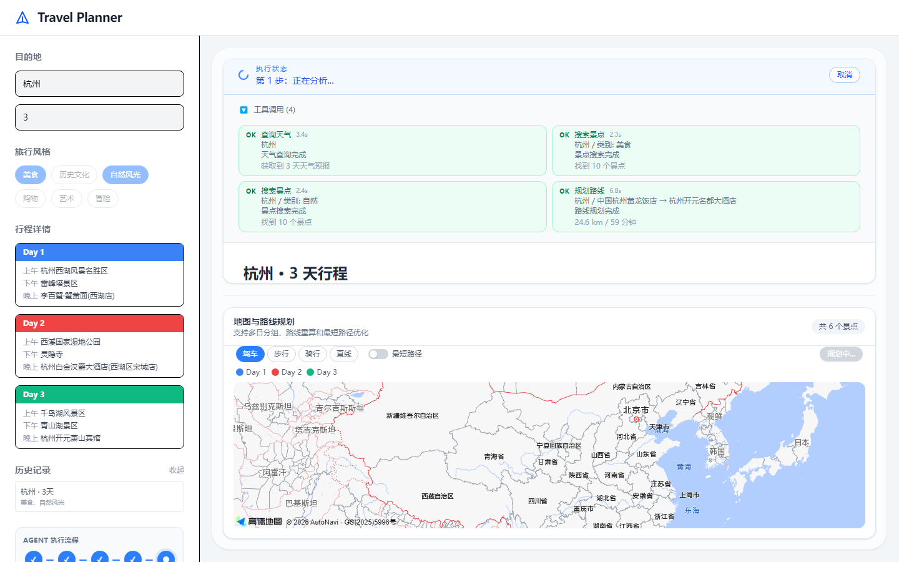
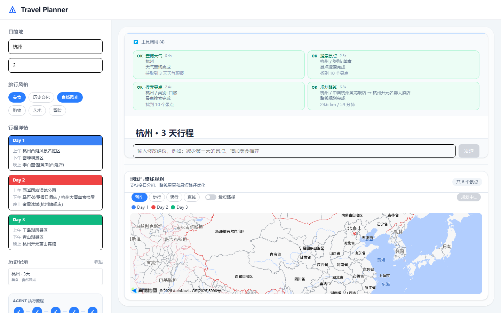
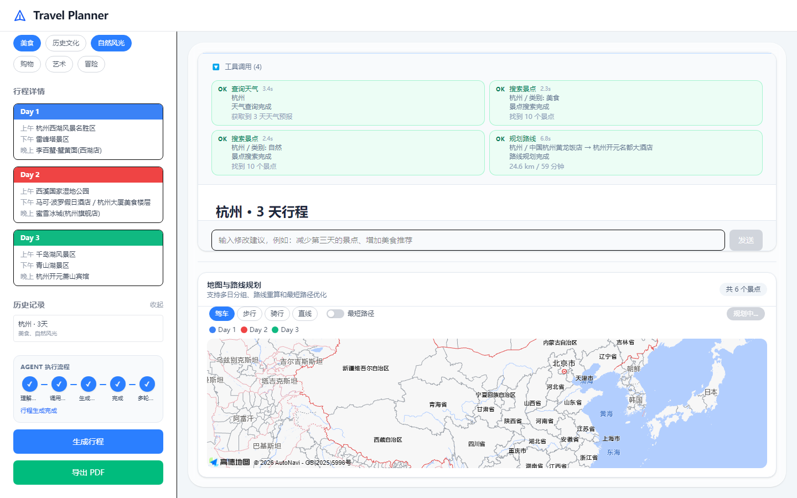

# Travel Planner

基于 AI Agent 的智能旅行规划工具——输入目的地、天数和偏好，Agent 自动调用天气、景点、路线等工具，流式生成完整行程，高德地图可视化标注，并支持多轮追问与 PDF 导出。

> 云端免费额度可能暂停；推荐用本页截图 + 本地运行做演示。

---

## 界面演示（全功能）

左侧「生成行程」上方有 **Agent 执行流程** 五步豆豆：

`理解需求 → 调用工具 → 生成行程 → 完成 → 多轮追问`

### 1. 初始空状态



### 2. 填写目的地 / 天数 / 风格



### 3. 启动生成（豆豆第 1 步）


### 4. 工具调用明细（天气 / 景点 / 路线）



### 5. 行程文案生成完成 + 可追问入口

首次生成结束后，豆豆停在「完成」，第 5 步「多轮追问」虚线圈提示可继续；底部出现「继续修改」输入框。



### 6. 地图与路线规划

分日图例、驾车/步行/骑行/最短路径；侧边同步行程详情卡片。



### 7. 多轮追问（填写修改建议）

例如：「第二天减少景点，多安排美食」——对应能力：会话内改行程。



### 8. 追问执行中（豆豆进入第 5 步）



### 9. 追问完成（五步全部勾选）

行程详情可随追问更新（如第二天更多美食点）。



### 10. 导出 PDF

生成成功后「导出 PDF」可用。



截图索引见 [`docs/screenshots/README.md`](docs/screenshots/README.md)。

---

## 功能概览

| 能力 | 说明 |
|------|------|
| 旅行规划 | 目的地 + 天数 + 风格 → Agent 编排 |
| 流程可视化 | 五步豆豆同步 SSE 阶段（含多轮追问） |
| 工具调用 | 天气、景点搜索、路线规划等（可展开查看） |
| 流式文案 | Markdown 行程实时输出 |
| 地图可视化 | 高德地图、分日标注、路径模式与最短路径 |
| 多轮追问 | 「继续修改」会话内改行程 |
| 历史记录 | 侧边可回看/加载历史会话 |
| PDF 导出 | 一键导出行程 |

---

## 技术栈

| 层级 | 技术 |
|------|------|
| 前端 | Vue 3 · TypeScript · Vite · Tailwind CSS · 高德 JS API 2.0 |
| 后端 | FastAPI · httpx · SSE · Redis · PostgreSQL |
| Agent | DeepSeek · MCP · Planner-Executor · ReAct |
| 部署 | Docker · Render / 其它云（可选） |

---

## 快速开始

### 本地开发

```bash
# 后端（默认 8000；若端口被占用：--port 8001，并改 vite.config.ts 代理）
cd backend
cp .env.example .env        # 填入 DEEPSEEK_API_KEY、AMAP_API_KEY
pip install -r requirements.txt
uvicorn app.main:app --reload --port 8000

# 前端（新终端）
npm install
npm run dev
```

前端 `http://localhost:5174`（`VITE_API_BASE_URL` 留空时走 Vite `/api` 代理）。

### Docker Compose

```bash
cp backend/.env.example backend/.env
docker compose up --build
```

---

## 环境变量

**前端**（`.env.development`）

| 变量 | 说明 |
|------|------|
| `VITE_API_BASE_URL` | 后端地址（开发留空走代理） |
| `VITE_API_SECRET_KEY` | 与后端 `API_SECRET_KEY` 一致 |
| `VITE_AMAP_KEY` | 高德 JS API Key |
| `VITE_AMAP_SECURITY_CODE` | 高德 JS 安全密钥 |

**后端**（`backend/.env`）

| 变量 | 说明 |
|------|------|
| `DEEPSEEK_API_KEY` | DeepSeek API Key |
| `AMAP_API_KEY` | 高德 Web 服务 Key |
| `API_SECRET_KEY` | 前后端鉴权 |
| `REDIS_URL` | Redis（可选，开发用内存模式） |
| `DATABASE_URL` | PostgreSQL（可选，开发用 JSON 文件落地） |

---

## API

| 方法 | 路径 | 说明 |
|------|------|------|
| POST | `/api/agent/generate` | SSE 流式生成行程 |
| POST | `/api/agent/chat` | SSE 多轮修改 |
| GET | `/api/sessions` | 历史会话 |
| GET/DELETE | `/api/sessions/{id}` | 会话详情 / 删除 |
| GET | `/api/memory` | 用户偏好 |
| GET | `/api/trace/{request_id}` | Agent 执行轨迹 |
| GET | `/api/health/live` | 存活探针 |
| GET | `/api/health/ready` | 就绪探针 |

鉴权：`X-API-Key` + `X-User-Id`

---

## 部署

Docker 单镜像可部署到 Render / Railway 等。免费额度用尽后线上会暂停，可用本仓库截图与本地运行做演示。
