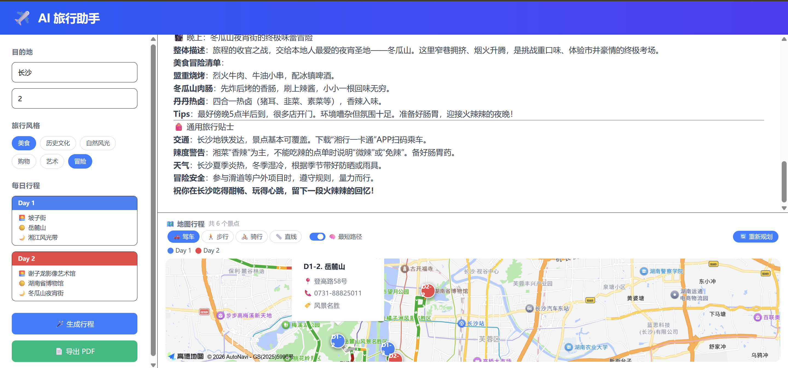
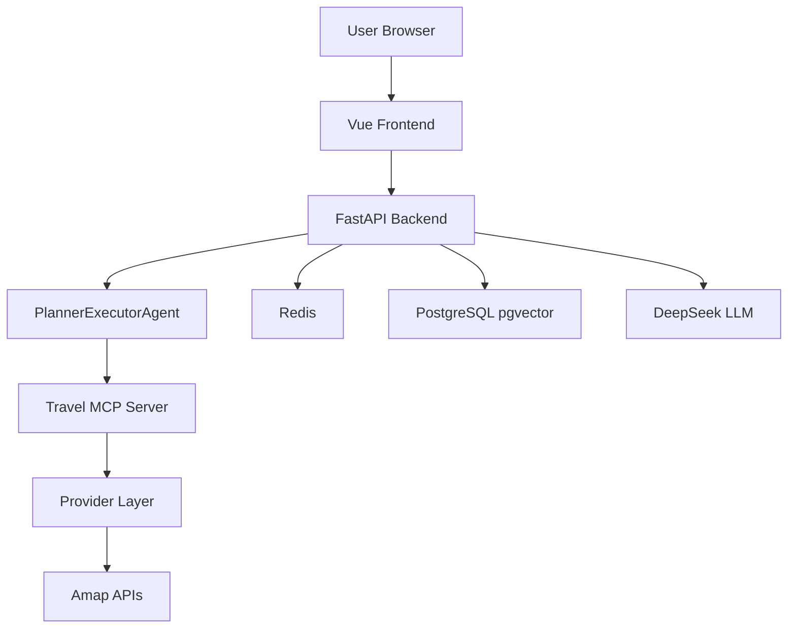
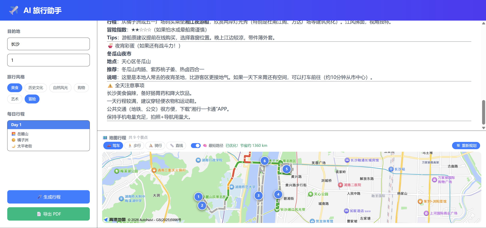
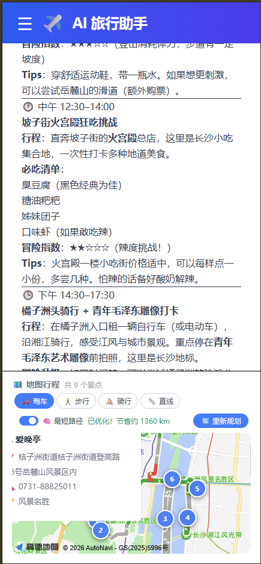

# AI Travel Helper

> Vue 3 前端 + FastAPI Agent 后端 + MCP 工具服务，输入目的地即可流式生成旅行行程，并在高德地图上标注路线。




🟢 **在线演示：https://ai-travel-helper-xxxx.onrender.com**

---

## 项目亮点

- **Agent 流式生成**：Planner → Executor → Finalize 全链路 SSE 推送
- **真实数据 Provider 层**：天气 / POI / 路线统一走高德 API，失败可 fallback
- **Agent Trace**：完整记录工具调用与执行步骤，支持 `GET /api/trace/{request_id}`
- **长期记忆**：Redis + PostgreSQL/pgvector 存储用户偏好
- **地图可视化**：景点标注、分日路线、Haversine + 贪心路径优化
- **工程化基础**：限流、健康检查、pytest、Docker Compose

---

## 架构



### 目录结构

```
ai-travel-helper/
├── src/                      # Vue 3 前端
│   ├── api/agent.ts          # SSE 客户端
│   ├── components/           # AgentPanel / Map
│   └── composables/          # useAgent / useItinerary
├── backend/                  # FastAPI 后端
│   ├── app/
│   │   ├── agents/           # Agent 主循环
│   │   ├── providers/        # 天气/POI/路线 Provider
│   │   ├── memory/           # 长期记忆
│   │   └── trace/            # Agent Trace
│   └── tests/                # pytest
├── travel-mcp-server/        # MCP 工具服务（stdio）
├── docker-compose.yml        # 全栈编排
└── docs/                     # 生产化报告等文档
```

### 技术栈

| 层级 | 技术 |
|------|------|
| 前端 | Vue 3、TypeScript、Vite、Tailwind CSS、高德 JS API |
| 后端 | FastAPI、httpx、asyncpg、Redis、sse-starlette |
| Agent | DeepSeek API、MCP、Planner-Executor 模式 |
| 数据 | PostgreSQL + pgvector、Redis |
| 部署 | Docker Compose、nginx |

---

## 快速开始

### 方式一：Docker Compose（推荐）

```bash
# 1. 配置后端环境变量
cp backend/.env.example backend/.env
# 编辑 backend/.env，填入 DEEPSEEK_API_KEY、AMAP_API_KEY、API_SECRET_KEY

# 2. 启动全栈
docker compose up --build

# 3. 访问
# 前端 http://localhost:5173
# 后端 http://localhost:8000/docs
```

### 方式二：本地开发

**前置要求**：Node.js 18+、Python 3.11+、Redis、PostgreSQL（可用 `docker compose up -d redis postgres`）

```bash
# 基础设施
docker compose up -d redis postgres

# 后端
cd backend
cp .env.example .env   # 填入 Key
pip install -r requirements.txt
uvicorn app.main:app --reload --port 8000

# 前端（新终端）
pnpm install
cp .env.example .env.development
pnpm dev
```

浏览器打开 `http://localhost:5174`（Vite 会将 `/api` 代理到 `localhost:8000`）。

---

## 环境变量

### 前端（`.env.development` / `.env.production`）

| 变量 | 说明 |
|------|------|
| `VITE_API_BASE_URL` | 后端地址；开发代理时可留空 |
| `VITE_API_SECRET_KEY` | 与后端 `API_SECRET_KEY` 一致 |
| `VITE_AMAP_KEY` | 高德 JS API Key（地图渲染） |

### 后端（`backend/.env`）

| 变量 | 说明 |
|------|------|
| `DEEPSEEK_API_KEY` | DeepSeek API Key（必填） |
| `AMAP_API_KEY` | 高德 Web 服务 Key（必填） |
| `API_SECRET_KEY` | 前后端共享鉴权 Key |
| `REDIS_URL` | Redis 连接串 |
| `DATABASE_URL` | PostgreSQL 连接串 |
| `ENV` | `development` / `production` |

完整说明见 [`backend/.env.example`](backend/.env.example)。

> 生产环境（`ENV=production`）会强制校验：强随机 `API_SECRET_KEY`、禁用 Memory/Trace 内存 fallback、要求 CORS 白名单。

---

## API 概览

| 方法 | 路径 | 说明 |
|------|------|------|
| POST | `/api/agent/generate` | SSE 生成行程 |
| POST | `/api/agent/chat` | SSE 多轮修改 |
| GET | `/api/memory` | 查询用户记忆 |
| GET | `/api/trace/{request_id}` | 查询 Agent 执行轨迹 |
| GET | `/api/health/live` | 存活探针 |
| GET | `/api/health/ready` | 就绪探针 |

请求头：
- `X-API-Key`：鉴权（必填）
- `X-User-Id`：用户标识（Memory/Trace 需要）

---

## 测试

```bash
cd backend
pip install -r requirements.txt
pytest -q

# 手工回归脚本（需后端运行）
python scripts/verify_planner_executor.py
python scripts/verify_trace_api.py
python scripts/verify_providers.py
```

---

## 功能截图




---

## 部署说明

- **不再适合纯静态托管**：SSE Agent 依赖 FastAPI 后端，GitHub Pages 仅适合旧版 Demo。
- **推荐部署**：Docker Compose 或前后端分离（frontend + backend + Redis + Postgres）。
- **生产化检查报告**：见 [`docs/PRODUCTION_HARDENING_REPORT.md`](docs/PRODUCTION_HARDENING_REPORT.md)。

---

## 作者

- GitHub: https://github.com/Kitty-0512
- 项目: AI Travel Helper
