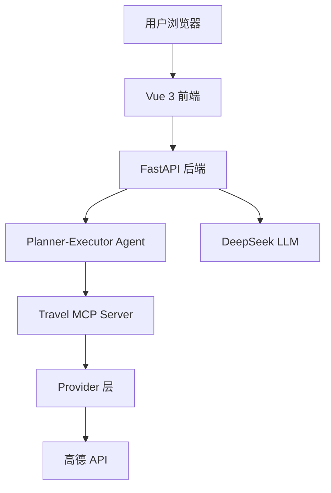

# AI Travel Helper

> 输入目的地，AI Agent 自动规划旅行行程，流式生成 + 高德地图可视化。

🟢 **在线演示：[https://ai-travel-helper.onrender.com](https://ai-travel-helper.onrender.com)**


---

## 项目简介

AI Travel Helper 是一个基于 AI Agent 的智能旅行规划工具。用户输入目的地后，Agent 自动调用天气、POI、路线等工具，流式生成完整的旅行行程，并在高德地图上标注景点和路线。

### 核心特性

- **Agent 流式生成** — Planner → Executor → Finalize 全链路 SSE 实时推送
- **真实数据** — 天气 / POI / 路线统一走高德 API，失败自动 fallback
- **Agent Trace** — 完整记录工具调用与执行步骤，支持 `GET /api/trace/{request_id}`
- **多轮对话** — 支持对已生成行程的追问和修改
- **地图可视化** — 景点标注、分日路线、路径优化
- **PDF 导出** — 一键导出行程为 PDF

---

## 架构



### 目录结构

```
ai-travel-helper/
├── src/                       # Vue 3 前端
│   ├── components/            # AgentPanel / Map
│   ├── composables/           # useAgent / useItinerary
│   └── api/                   # SSE 客户端
├── backend/                   # FastAPI 后端
│   └── app/
│       ├── agents/            # Agent 主循环
│       ├── providers/         # 天气/POI/路线 Provider
│       ├── routers/           # API 路由
│       ├── mcp/               # MCP 客户端
│       ├── memory/            # 长期记忆
│       └── trace/             # Agent 执行追踪
├── travel-mcp-server/         # MCP 工具服务
├── docker/                    # Nginx 配置
├── docs/                      # 文档
├── Dockerfile                 # 统一构建（前后端 + MCP）
├── docker-compose.yml         # 本地开发全栈编排
└── scripts/                   # 辅助脚本
```

### 技术栈

| 层级 | 技术 |
|------|------|
| 前端 | Vue 3、TypeScript、Vite、Tailwind CSS、高德 JS API |
| 后端 | FastAPI、httpx、SSE |
| Agent | DeepSeek API、MCP、Planner-Executor 模式 |
| 地图 | 高德地图 JS API 2.0 |
| 部署 | Docker、Render |

---

## 快速开始

### Docker Compose（本地全栈）

```bash
# 1. 配置环境变量
cp backend/.env.example backend/.env
# 编辑 backend/.env，填入 DEEPSEEK_API_KEY、AMAP_API_KEY、API_SECRET_KEY

# 2. 启动
docker compose up --build

# 3. 访问
# 前端 http://localhost:5173
# 后端 http://localhost:8000/docs
```

### 本地开发

**前置要求**：Node.js 18+、Python 3.11+

```bash
# 后端
cd backend
cp .env.example .env
pip install -r requirements.txt
uvicorn app.main:app --reload --port 8000

# 前端（新终端）
pnpm install
pnpm dev
```

---

## 环境变量

### 前端（`.env.development` / `.env.production`）

| 变量 | 说明 |
|------|------|
| `VITE_API_BASE_URL` | 后端地址 |
| `VITE_API_SECRET_KEY` | 与后端 `API_SECRET_KEY` 一致 |
| `VITE_AMAP_KEY` | 高德 JS API Key（地图渲染） |

### 后端（`backend/.env`）

| 变量 | 说明 |
|------|------|
| `DEEPSEEK_API_KEY` | DeepSeek API Key |
| `AMAP_API_KEY` | 高德 Web 服务 Key |
| `API_SECRET_KEY` | 前后端鉴权 Key |
| `REDIS_URL` | Redis 连接串（开发模式可选） |
| `DATABASE_URL` | PostgreSQL 连接串（开发模式可选） |
| `ENV` | `development` / `production` |

---

## API 概览

| 方法 | 路径 | 说明 |
|------|------|------|
| POST | `/api/agent/generate` | SSE 流式生成行程 |
| POST | `/api/agent/chat` | SSE 多轮对话修改 |
| GET | `/api/memory` | 查询用户记忆 |
| GET | `/api/trace/{request_id}` | 查询 Agent 执行轨迹 |
| GET | `/api/sessions` | 查询历史会话 |
| GET | `/api/health/live` | 存活探针 |
| GET | `/api/health/ready` | 就绪探针 |

请求头：`X-API-Key`（鉴权）、`X-User-Id`（用户标识）

---

## 测试

```bash
cd backend
pip install -r requirements.txt
pytest -q

# 手工回归脚本
python scripts/verify_planner_executor.py
python scripts/verify_trace_api.py
python scripts/verify_providers.py
```

---

## 部署

本项目部署在 [Render](https://render.com) 上，使用根目录 `Dockerfile` 统一构建前端 + 后端 + MCP Server，端口 `8000`。

### 环境变量（Render）

| Key | 说明 |
|-----|------|
| `DEEPSEEK_API_KEY` | LLM API Key |
| `AMAP_API_KEY` | 高德 Web 服务 API Key |
| `API_SECRET_KEY` | 前后端鉴权 |
| `VITE_API_SECRET_KEY` | 前端构建时注入，与上面一致 |
| `VITE_AMAP_KEY` | 高德 JS API Key |

---

## 功能截图


---

## 作者

- GitHub: [Kitty-0512](https://github.com/Kitty-0512)
- 项目: [ai-travel-helper](https://github.com/Kitty-0512/ai-travel-helper)
