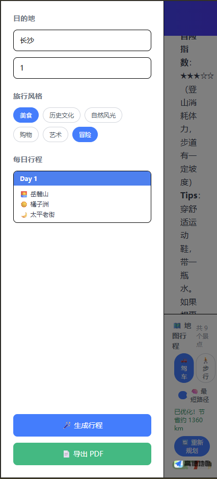
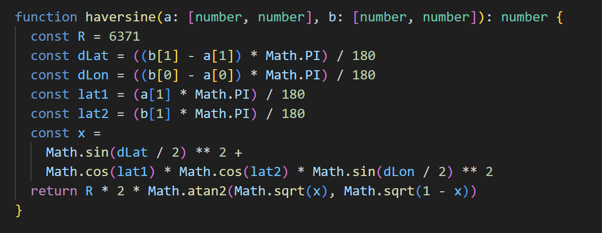
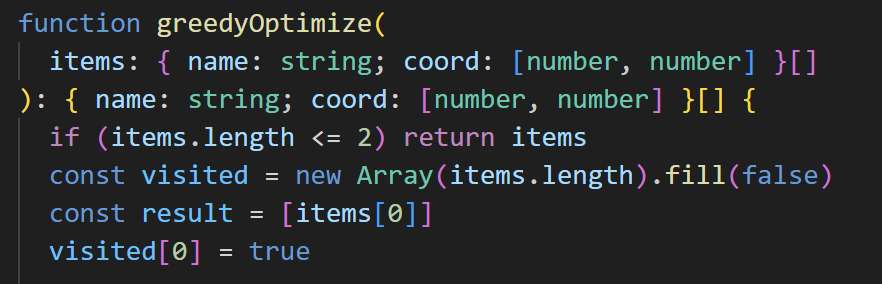

# 🗺️ AI 智能旅行规划助手

> 输入目的地和天数，AI 自动生成完整旅行行程，并在高德地图上实时标注景点路线。

**[🌐 在线体验 Demo](https://kitty-0512.github.io/ai-travel-helper/)**


---
## 🚀 项目亮点

- 🤖 AI 流式生成旅行行程
- 🗺️ 高德地图路径可视化
- 📍 Haversine + 贪心算法路径优化
- 📄 PDF 一键导出
- 📱 响应式设计
- ⚡ Vercel 在线部署
  
## ✨ 功能介绍

### 🤖 AI 行程生成

- 输入目的地城市和旅行天数，一键生成完整行程
- 支持多种旅行风格偏好选择：美食 / 历史文化 / 自然风光 / 购物 / 艺术 / 冒险
- 调用 DeepSeek API **流式输出**，文字逐字出现，类似打字机效果，无需等待

### 📄 Markdown 富文本展示

- 行程内容以 Markdown 格式渲染，包含层级标题、每日安排、实用贴士
- 自动过滤 AI 输出的 JSON 数据块，只展示可读的行程文字

### 🗺️ 高德地图集成

- 生成行程后自动定位到目的地城市
- 所有景点在地图上以**编号圆点**标注，点击弹出景点名称信息卡片
- 按天分色路线：Day 1 蓝色、Day 2 红色、Day 3 绿色……
- 支持四种路线模式切换：驾车 / 步行 / 骑行 / 直线连接


### 📍 景点路径优化

- 使用 **Haversine 公式**计算经纬度点之间的真实球面距离
- 基于**贪心最近邻算法**自动优化景点游览顺序
- 显示优化后相比原始顺序节省的公里数


### 📋 每日行程卡片

- 左侧面板展示每天上午 / 下午 / 晚上的景点安排
- 自动过滤交通、天气等非景点内容，只展示核心景点

### 📥 PDF 一键导出

- 支持将完整行程导出为 A4 PDF 文件
- 解决了 html2canvas 滚动截图不完整的问题（动态展开 DOM 再截图）

### 📱 响应式设计

- 桌面端：左侧固定面板 + 右侧内容区布局
- 移动端：侧边栏变为抽屉式，生成后自动收起
  



---

## 🏗️ 技术架构

```
src/
├── api/
│   └── ai.ts          # DeepSeek API 调用 & 流式输出处理
├── components/
│   └── Map.vue        # 高德地图组件（Marker / Polyline / 路线规划）
├── utils/
│   └── tsp.ts         # Haversine 公式 + 贪心路径优化算法
├── App.vue            # 主页面（行程生成 / Markdown渲染 / PDF导出）
└── main.ts            # 应用入口
```

### 核心技术栈

| 类别     | 技术                    | 说明                                       |
| -------- | ----------------------- | ------------------------------------------ |
| 前端框架 | Vue 3 + Composition API | `<script setup>` 写法，响应式状态管理      |
| 语言     | TypeScript              | 全量类型标注，接口与数据结构清晰           |
| 构建工具 | Vite 8                  | 极速热更新，生产构建优化                   |
| 样式     | Tailwind CSS 4          | 工具类 + 响应式断点                        |
| AI 接口  | DeepSeek API            | `stream: true` 流式输出，SSE 逐 chunk 解析 |
| 地图     | 高德地图 AMap JS SDK    | Marker / Polyline / 驾车步行路线规划       |
| Markdown | marked v18              | AI 文本 → HTML 富文本渲染                  |
| PDF 导出 | html2canvas-pro + jsPDF | DOM 截图 → 分页 PDF                        |
| 部署     | Vercel                  | 自动 CI/CD，环境变量管理                   |

### 流式输出数据流

```
用户输入目的地 & 天数
        ↓
调用 DeepSeek API（stream: true）
        ↓
ReadableStream → TextDecoder → 逐行解析 SSE
        ↓
解析 data: {...} → 提取 delta.content → 追加到页面
        ↓
流结束后，正则提取末尾 JSON 块
        ↓
解析景点数据 → 渲染地图 Marker & Polyline
```

### 路径优化算法

```typescript
// Haversine 公式：计算球面两点真实距离（km）
function haversine(a: [number, number], b: [number, number]): number {
  const R = 6371 // 地球半径
  // ... 三角函数计算大圆距离
}

// 贪心最近邻：每次选距离当前点最近的未访问景点
function optimizeRoute(coords, names) {
  let current = 0
  while (未访问景点存在) {
    nearest = 找到距离 current 最近的未访问点
    路线.push(nearest)
    current = nearest
  }
}
```


---

## 🚀 本地运行

### 前置要求

- Node.js >= 18
- pnpm（推荐）或 npm

### 1. 克隆项目

```bash
git clone https://github.com/你的用户名/ai-travel-helper.git
cd ai-travel-helper
```

### 2. 安装依赖

```bash
pnpm install
# 或
npm install
```

### 3. 配置环境变量

在项目根目录新建 `.env` 文件：

```env
# DeepSeek API Key（前往 platform.deepseek.com 获取）
VITE_DEEPSEEK_API_KEY=your_deepseek_api_key_here

# 高德地图 Web JS API Key（前往 lbs.amap.com 获取）
VITE_AMAP_KEY=your_amap_key_here
```

> ⚠️ 注意：`.env` 文件已加入 `.gitignore`，请勿将 API Key 提交到代码仓库。

### 4. 启动开发服务器

```bash
pnpm dev
```

浏览器打开 `http://localhost:5173` 即可。

### 5. 生产构建

```bash
pnpm build
pnpm preview  # 本地预览构建产物
```

---

## 🌐 部署到 Vercel

1. Fork 本项目到你的 GitHub
2. 在 [Vercel](https://vercel.com) 导入该仓库
3. 在 Vercel 项目设置 → Environment Variables 中添加：
   - `VITE_DEEPSEEK_API_KEY`
   - `VITE_AMAP_KEY`
4. 点击 Deploy，完成！

---

## 📌 使用说明

1. 在左侧面板输入**目的地**（如：北京、东京、巴黎）
2. 填写**旅行天数**（1 - 14 天）
3. 可选择一个或多个**旅行风格**标签
4. 点击 **🪄 生成行程**，等待 AI 流式输出
5. 行程生成后，右侧地图自动标注景点并连线
6. 点击地图上的景点圆点，可查看景点信息卡片
7. 点击 **📄 导出 PDF**，保存完整行程到本地

---

## 🔧 已知问题 & 待优化

- [ ] API Key 当前存于前端环境变量，生产环境建议迁移到后端服务
- [ ] `v-html` 渲染存在 XSS 风险，待接入 DOMPurify 过滤
- [ ] 贪心算法为局部最优，景点较多时可引入 2-opt 优化进一步提升路径质量
- [ ] 高德地图景点搜索依赖 POI 数据，偏远地区景点可能匹配不准确

---
## 👨‍💻 作者

- GitHub: https://github.com/Kitty-0512
- 项目: AI Travel Helper
- 技术方向: 前端 + AI 应用
